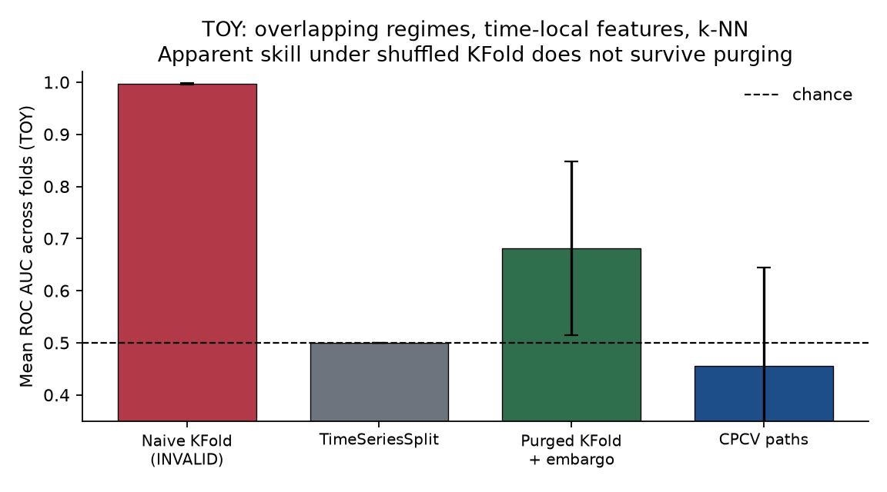

# Leakage-proof evaluation for financial machine learning

**Hossein Tabasi** · 2026 · software + toy experiment (`finmlcv` 0.1.0)

International M.Tech (CSE) student working on AI/ML, with a focus on time-series models (including LSTM) and crypto forecasting. This repository is a junior-research artefact aimed at CSE PhD labs in quantitative finance, market microstructure, causal ML, and graph ML for markets. It is a library plus a workshop-style experiment, not a Kaggle notebook.

All numerical claims below are labelled **TOY**. They come from `results/tables/synthetic_leakage.csv` and `results/tables/benchmark_protocols.csv`, produced by `make toy`. They are not live PnL, not a market backtest, and not a claim of alpha.

---

## Question

How much of the *apparent* skill of a financial ML classifier is an artefact of the evaluation protocol?

Concretely: if labels occupy a time interval (fixed-horizon or triple-barrier) rather than a point, and if a flexible model can interpolate from time-neighbours, what happens to ROC AUC, a long/short overlay Sharpe, and the deflated Sharpe ratio (DSR) when we replace shuffled `KFold` with (i) `TimeSeriesSplit`, (ii) purged *k*-fold plus embargo, and (iii) combinatorial purged CV (CPCV) paths?

A second, distinct question: does purging fix a *feature* that already contains the future? (It should not.)

## Why it matters

Standard *k*-fold CV assumes IID samples. Financial labels with horizon *h* > 1 violate that: the intervals \([t, t_1]\) and \([t+1, t_1+1]\) share a price path. A random split places overlapping observations on both sides of the fold. A neighbour-based or tree model then interpolates a relationship that is not available at decision time. Reported AUC and Sharpe become properties of the splitter, not of a trading rule.

Purging (López de Prado, *Advances in Financial Machine Learning*, ch. 7) drops training rows whose label interval overlaps the test information interval. Embargo drops a further buffer after each test block, targeting residual serial correlation. CPCV (AFML ch. 12) replaces a single walk-forward number with a *distribution* of backtest paths. DSR (Bailey & López de Prado, 2014) asks whether an observed Sharpe is large relative to the expected *maximum* Sharpe among `n_trials` independent noise experiments. Multiple-testing haircuts of this kind are the backtesting protocol of Arnott, Harvey & Markowitz (2019) and the multiple-testing discussion of Harvey, Liu & Zhu (2016, *RFS*).

None of these tools create alpha. They are how one *stops claiming it* from a contaminated split.

## Data

**TOY (this README).** Two synthetic DGPs, seed 42, \(n=800\) unless noted; plus a synthetic daily-like panel of 1,200 bars with a weak AR(1) return (`phi = 0.08`) used only for the protocol-Sharpe table.

1. `overlap_local` — piecewise-constant unobserved regime labels (32 regimes), features = scaled time + tiny noise. There is **no** walk-forward edge: a test block whose neighbours have been purged should score near 1/2. *k*-NN interpolates regimes from time-neighbours when those neighbours are in the training set.
2. `future_column` — binary label = sign of a future Gaussian; that Gaussian is written into `X` as `x_leak`. Every splitter should look perfect until the auditor drops the column.

**FULL (optional, not run here).** `configs/experiment.yaml` has `mode: full` and tickers `SPY`, `QQQ`, `BTC-USD`. `scripts/download_data.py` attempts Ken French daily factors, Yahoo, then Stooq, with a local cache and SHA-256 printout. If download fails, FULL is skipped. This run used `mode: toy`; no vendor series were loaded. FI-2010 (LOB) is not bundled.

Features on the synthetic panel are lagged returns, realised vol, and a trailing-mean deviation, all known at the close of \(t\). NaNs are dropped **before** splitting.

## Method

- **Labels.** Fixed-horizon log returns; triple-barrier (vertical + upper/lower) and meta-labels (`src/finmlcv/labeling.py`).
- **Splitters** (`src/finmlcv/splits.py`), sklearn-compatible `split(X, y, groups=None)`:
  - `PurgedKFold` — contiguous folds; purge overlapping \([t, t_1]\); embargo.
  - `CombinatorialPurgedCV` — \(N\) groups, \(k\) test groups, all \(\binom{N}{k}\) combinations; path reconstruction with \(\binom{N-1}{k-1}\) paths covering the timeline exactly once each.
  - Wrappers: `NaiveKFold` (shuffled; labelled INVALID) and `WalkForwardSplit` (`TimeSeriesSplit`).
- **Diagnostics.** Sharpe, PSR, DSR (skew/kurtosis-corrected; `n_trials` is an assumption), IC, turnover, max drawdown; F1, MCC, balanced accuracy. Raw accuracy is not a headline metric.
- **Leakage audit.** Overlapping labels vs a proposed split; feature timestamp after label start; same-timestamp merge hazards; columns that copy \(y\) or \(y[t+1]\) (`src/finmlcv/leakage.py`).
- **Models.** Logistic regression, random forest, sklearn GBM (XGBoost extra if installed), optional tiny CPU LSTM (PyTorch extra). This TOY run used *k*-NN and logistic regression. PyTorch and XGBoost were not installed.

Reimplemented from AFML; not a copy of mlfinlab; no GPL vendoring.

## Baselines

| Protocol | Status | Role |
| --- | --- | --- |
| Shuffled `KFold` | INVALID for overlapping labels | Optimistic baseline |
| `TimeSeriesSplit` | Causal, but no purge of label lifetime | Walk-forward baseline |
| Purged *k*-fold + embargo | AFML ch. 7 | Single-split honest CV |
| CPCV paths | AFML ch. 12 | Distribution over backtests |

## Results (TOY)

Figure 1 — overlapping regimes, time-local features, *k*-NN. Numbers from `results/tables/synthetic_leakage.csv`.



**Table 1.** Mean ROC AUC (TOY, `overlap_local`, *k*-NN, seed 42). Chance is 0.5.

| Protocol | Folds scored | AUC mean | AUC std | AUC min | AUC max |
| --- | ---: | ---: | ---: | ---: | ---: |
| Naive KFold (INVALID) | 5 | 0.997 | 0.001 | 0.996 | 0.998 |
| TimeSeriesSplit | 4 | 0.500 | 0.000 | 0.500 | 0.500 |
| Purged KFold + embargo 1% | 5 | 0.681 | 0.167 | 0.500 | 0.827 |
| CPCV | 15 | 0.456 | 0.188 | 0.136 | 0.836 |

Shuffled KFold reports essentially perfect ranking. TimeSeriesSplit, which never trains on the future of a test block, is exactly chance. Purged *k*-fold is above 1/2 on some folds (edge interpolation from the un-purged side of a contiguous hole) but far below the shuffled number; CPCV, averaging many combinatorial holes, sits at 0.46. Residual AUC above 1/2 on a subset of purged folds is expected: *k*-NN still sees the two block edges. It is not a claim of residual alpha.

**Table 2.** Explicit look-ahead in \(X\): `x_leak` = the future return that defines \(y\). Logistic regression. Same CSV.

| DGP | Naive KFold | TimeSeriesSplit | Purged KFold | CPCV |
| --- | ---: | ---: | ---: | ---: |
| `future_column` (leak in \(X\)) | 1.000 | 1.000 | 1.000 | 1.000 |
| leak dropped after audit | 0.523 | 0.506 | 0.515 | 0.511 |

The auditor flags `x_leak` (`results/tables/leakage_audit_toy.csv`, score 0.55). Purging does not fix a future column. Dropping it does.

**Table 3.** Synthetic daily-like panel (weak AR(1), horizon 10, logistic, 1,170 aligned rows). Long/short overlay on the forward log return. **Not live PnL.** From `results/tables/benchmark_protocols.csv`. DSR uses `n_trials = 20`.

| Protocol | AUC mean | Sharpe mean | Sharpe std | DSR mean | Fraction Sharpe > 0 |
| --- | ---: | ---: | ---: | ---: | ---: |
| Naive KFold (INVALID) | 0.561 | 2.08 | 0.81 | 0.53 | 1.00 |
| TimeSeriesSplit | 0.508 | 0.81 | 3.07 | 0.39 | 0.60 |
| Purged KFold (embargo 1%) | 0.518 | 0.16 | 2.69 | 0.23 | 0.60 |
| CPCV (5 reconstructed paths) | 0.522 | 1.22 | 0.63 | 0.65 | 1.00 |

The only number that should not be taken at face value is the shuffled-KFold Sharpe of 2.08 with every fold positive. Purged *k*-fold on the same features and labels produces a mean Sharpe of 0.16 and DSR 0.23. CPCV path Sharpes are computed on *full-timeline* concatenations, so they are not comparable one-for-one with per-fold Sharpes (shorter test blocks, larger sampling error). That difference is discussed in `docs/REPORT.md`.

## Ablations

Embargo ∈ {0, 1%, 5%} of sample size, purged *k*-fold, same TOY panel:

| Embargo | AUC mean | Sharpe mean | DSR mean | Fraction Sharpe > 0 |
| ---: | ---: | ---: | ---: | ---: |
| 0% | 0.516 | 0.13 | 0.22 | 0.60 |
| 1% | 0.518 | 0.16 | 0.23 | 0.60 |
| 5% | 0.506 | 0.21 | 0.24 | 0.60 |

On this DGP the embargo grid barely moves AUC; the interesting contrast remains shuffled vs purged, not 1% vs 5%. A larger embargo on a series with slower residual autocorrelation would be a natural extension.

## Limitations

- **TOY only.** No equity, futures, or crypto market is scored in this README. FULL mode was not attempted (`mode: toy`).
- **FI-2010** (limit-order-book) is not included; it has a separate licence.
- Purged *k*-fold on `overlap_local` does not collapse *all the way* to 0.50 on every fold, because a contiguous hole still has two edges in feature space. CPCV is closer to chance in the mean and more variable across combinations.
- DSR treats `n_trials` as known and trials as independent. Both are assumptions. Understated `n_trials` inflates DSR.
- The long/short overlay is a diagnostic, not a strategy: unit leverage, no costs, no latency, no borrow.
- LSTM/XGBoost extras are optional. This run used sklearn only.
- Combinatorial explosion: \(\binom{N}{k}\) splits. Defaults \(N=6, k=2\) (15 splits, 5 paths) are for laptops, not a research grid.

## What a supervisor can extend

- Replace the AR(1) panel with point-in-time equity characteristics (e.g. Gu, Kelly & Xiu 2020 style) and report CPCV-path DSR rather than a single OOS Sharpe.
- Microstructure: triple-barrier labels on FI-2010 or crypto trades, with embargo in event time rather than wall-clock bars.
- Causal ML: use the leakage audit as a pre-test before any invariant-risk or double-ML procedure on markets.
- Graph ML: purged splits on a rolling co-occurrence or LOD graph so that neighbours of a test name are not in train during the label lifetime.
- Nested CPCV for model *selection* vs evaluation; Harvey–Liu–Zhu haircuts on the outer path Sharpes.
- Transaction-cost overlay and turnover as first-class constraints, not afterthoughts.

## How to run

Python ≥ 3.11. From the repository root:

```bash
python -m venv .venv
source .venv/bin/activate
pip install -e ".[dev]"
make test
make toy
```

Optional extras: `pip install -e ".[torch]"` and `pip install -e ".[xgboost]"`. If XGBoost is missing, `make_model("xgboost")` falls back to sklearn `GradientBoostingClassifier`. If PyTorch is missing, `make_model("lstm")` raises a clear `ImportError`.

FULL (optional):

```bash
python scripts/download_data.py --tickers SPY QQQ BTC-USD
# then set mode: full in configs/experiment.yaml
python -m finmlcv.experiments.run_benchmark
```

If the download fails, the benchmark prints a skip note and still writes the TOY table.

`make figures` redraws PNGs from the CSVs; it does not invent numbers.

## Citation

See `CITATION.cff`. Please also cite the methods this library implements: López de Prado (2018), Bailey & López de Prado (2014), Arnott, Harvey & Markowitz (2019), Harvey, Liu & Zhu (2016). Bibliographic entries are in `docs/references.bib`. A longer write-up is `docs/REPORT.md`.

License: MIT, copyright Hossein Tabasi, 2026.
